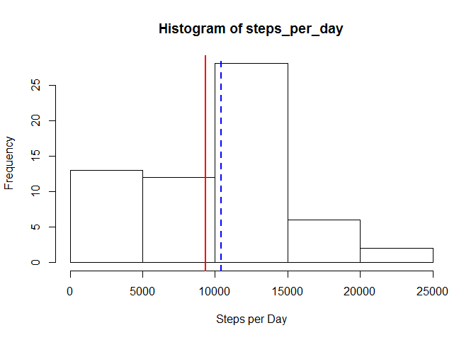
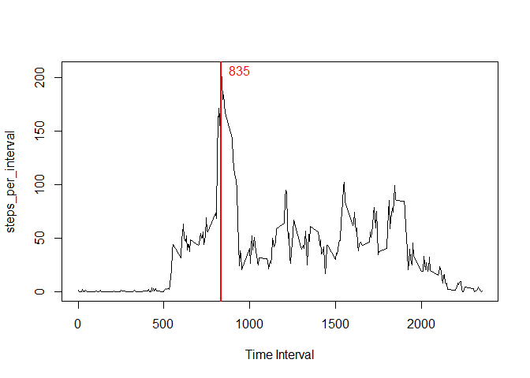
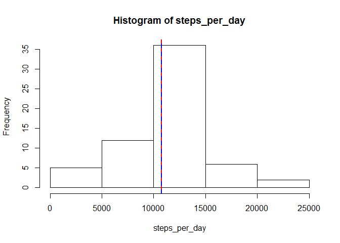
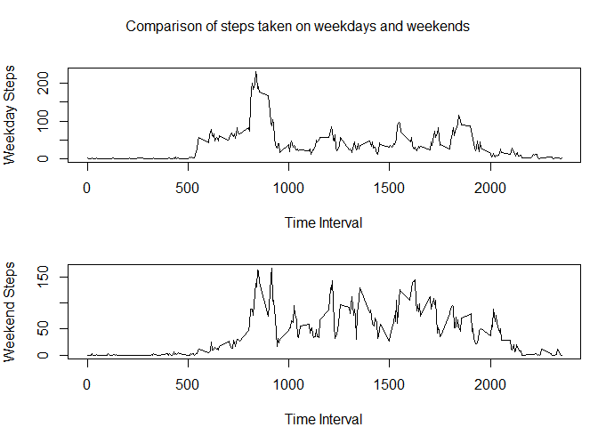

# Reproducible Research: Peer Assessment 1


## Loading and preprocessing the data

So, let's load all activity data into the `raw_data` variable and make some overview of it.


```r
raw_data <- read.csv("activity.csv")

head(raw_data)
```

```
##   steps       date interval
## 1    NA 2012-10-01        0
## 2    NA 2012-10-01        5
## 3    NA 2012-10-01       10
## 4    NA 2012-10-01       15
## 5    NA 2012-10-01       20
## 6    NA 2012-10-01       25
```

```r
str(raw_data)
```

```
## 'data.frame':	17568 obs. of  3 variables:
##  $ steps   : int  NA NA NA NA NA NA NA NA NA NA ...
##  $ date    : Factor w/ 61 levels "2012-10-01","2012-10-02",..: 1 1 1 1 1 1 1 1 1 1 ...
##  $ interval: int  0 5 10 15 20 25 30 35 40 45 ...
```

We can see there are lots of NA values in `steps` column.

  
  
## What is mean total number of steps taken per day?

First let's split `raw_data` into lists by `date` column and count the **sum** of `steps` for each day ignoring the NA values and saving it in `steps_per_day` variable.


```r
steps_per_day <- sapply(split(raw_data$steps, raw_data$date), sum, na.rm=TRUE)
```

Then let's count mean and median for steps per day and print them.


```r
mean_steps <- mean(steps_per_day)
mean_steps
```

```
## [1] 9354.23
```

```r
median_steps <- median(steps_per_day)
median_steps
```

```
## [1] 10395
```

Now we plot a histogram of the frequency of steps per day showing mean as red line and median as blue dashed line:


```r
hist(steps_per_day, xlab="Steps per Day")
abline(v = mean_steps, col="red", lwd=2)
abline(v = median_steps, col="blue", lty="dashed", lwd=2)
```

 

Nice plot :)
  
  
## What is the average daily activity pattern?

Let's split all data onto intervals and count mean values for each interval ignoring the NA values.

```r
steps_per_interval <- sapply(split(raw_data$steps, raw_data$interval), mean, na.rm=TRUE)
```

Now we are finding the exact 5-minute interval in which the average amount of steps per interval was maximum.

```r
max_steps_interval <- names(steps_per_interval)[which.max(steps_per_interval)]
```

Let's now draw a plot of the average daily activity pattern and show on which of the 5-minute time intervals the amount of steps was at the maximum. Let's point on it with the red vertical line and put the name of the interval to the corresponding point.

```r
plot(x=names(steps_per_interval), y=steps_per_interval, type="l", xlab="Time Interval")
abline(v = max_steps_interval, col="red", lwd=2)
text(max_steps_interval, max(steps_per_interval), max_steps_interval, pos=4, col="red")
```

 

We can see that this 5-minute interval is **8:35** - obviously when people go for work in the morning.
  
  
## Imputing missing values

First of all let's see how many NA values is there in the raw dataset and count it's percentage:

```r
sum(is.na(raw_data$steps))
```

```
## [1] 2304
```

```r
sum(is.na(raw_data$steps))/nrow(raw_data)
```

```
## [1] 0.1311475
```

Well, there are **2304** NA values which is almost 13% of the data. Not so good!
  
Let's create a vector of indexes of NA values: `na_indexes`

```r
na_indexes <- is.na(raw_data$steps)
```

Now we are creating a dataframe containing NA values and their intervals so that we could then fill them with the average values.

```r
na_vector <- raw_data[na_indexes, c(1,3)]
```

Let's create a data frame `avg_steps` containing average values in interval - we will take previously created `steps_per_interval` variable for this. So, this data frame will have columns named *interval* and *steps*.

```r
avg_steps <- data.frame(names(steps_per_interval), steps_per_interval)
names(avg_steps) <- c("interval", "steps")
```

Now we are using for loop to fill the `na_vector` with values of average steps in those intervals

```r
for(i in 1:nrow(na_vector)) {na_vector$steps[i] <- avg_steps$steps[avg_steps$interval == na_vector$interval[i]]}
```


Let's create new dataframe `full_data` and assign non-NA values to NA indexes of it. Now it is complete.

```r
full_data <- raw_data

full_data$steps[na_indexes] <- na_vector$steps
```

We need to be sure there is no missing data here:

```r
sum(is.na(full_data))
```

```
## [1] 0
```

Now we are counting steps per day in the complete data set and its mean and median, the same way we did before for the data set with the NA data.


```r
steps_per_day <- sapply(split(full_data$steps, full_data$date), sum)
mean_steps <- mean(steps_per_day)
median_steps <- median(steps_per_day)
```

Let's plot a histogram for the complete data now and plot a mean as a red line and a median as a blue dotted line.

```r
hist(steps_per_day)
abline(v = mean_steps, col="red", lwd=2)
abline(v = median_steps, col="blue", lty="dashed", lwd=2)
```

 

We can see that filling data set NA values with average data moved the mean value higher to the right and made it equal to the median value.
  
  
## Are there differences in activity patterns between weekdays and weekends?

First let's set the system locale to English to make `weekdays()` function return all week days in English:

```r
Sys.setlocale("LC_TIME", "English")
```

```
## [1] "English_United States.1252"
```

Now we are extracting a vector of week days names for each record in the second column of `full_data` and saving it to `wd_vector`.

```r
wd_vector <- weekdays(as.Date(full_data[,2]), abbreviate=T)
```

Now we are assigning the value **"weekend"** to those records of `full_data` where week day is **Sat** or **Sun**, otherwise - assigning **"weekday"**. Then we are naming this column as `day`.

```r
for(i in 1:nrow(full_data)) {full_data[i, 4] <- if(wd_vector[i] %in% c("Sat", "Sun")) {"weekend"} else {"weekday"}}
names(full_data)[4] <- "day"
```

Let's create two separate dataframes: for weekdays and weekends:

```r
weekday_data <- full_data[full_data$day == "weekday",]
weekend_data <- full_data[full_data$day == "weekend",]
```

Let's count average steps for each interval separately for weekdays and weekends

```r
weekday_steps <- sapply(split(weekday_data$steps, weekday_data$interval), mean)
weekend_steps <- sapply(split(weekend_data$steps, weekend_data$interval), mean)
```

And finally we are drawing plots showing the steps taken on weekdays and weekends.

```r
par(mfrow = c(2, 1), mar = c(4, 4, 2, 1), oma = c(0, 0, 2, 0))
plot(x=names(weekday_steps), y=weekday_steps, type="l", xlab="Time Interval", ylab="Weekday Steps")
plot(x=names(weekend_steps), y=weekend_steps, type="l", xlab="Time Interval", ylab="Weekend Steps")
mtext("Comparison of steps taken on weekdays and weekends", outer = TRUE)
```

 

Interesting! :)
  
   
